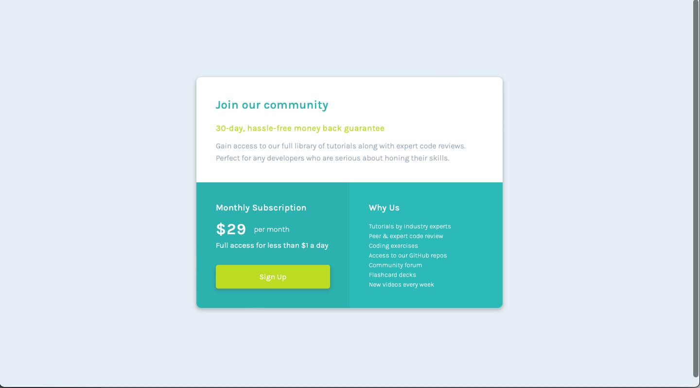

# Frontend Mentor - Single price grid component solution

This is a solution to the [Single price grid component challenge on Frontend Mentor](https://www.frontendmentor.io/challenges/single-price-grid-component-5ce41129d0ff452fec5abbbc). Frontend Mentor challenges help you improve your coding skills by building realistic projects. 

## Table of contents

- [Overview](#overview)
  - [The challenge](#the-challenge)
  - [Screenshot](#screenshot)
  - [Links](#links)
- [My process](#my-process)
  - [Built with](#built-with)
  - [Useful resources and tools](#useful-resources-and-tools)
- [Author](#author)

## Overview

To build a responsive single price card using CSS grid, to look as close as the desktop and mobile design of the images provided.

### The challenge

Users should be able to:

- View the optimal layout for the component depending on their device's screen size
- See a hover state on desktop for the Sign Up call-to-action

### Screenshot

### Links

- Solution URL: [Solution](https://github.com/byKrissK/FrontendMentor-Single-price-grid-component)
- Live Site URL: [Live Site](https://bykrissk.github.io/FrontendMentor-Single-price-grid-component/)

## My process

1. Study the style guide and design images.
2. Structure html skeleton with semantic and non-semantic tag eg. div as container to hold class easy styling and layout.
3. Open live browser in dev mode resposive view and place side by side with the given design image. Started from desktop to mobile screen size.
4. Go to stylesheet and do the reset on margin / padding to 0, box sizing to border box for a more accurate measurement during styling process.
5. Create CSS custom properties for colors as per style guide and font-sizes in rem, eg. --fs12 equal to 12px which is : .75rem and set colors, font-family, as well as other basic properties.
6. Style container using CSS Grid.
7. Adjust accordingly, while looking at the design image given.
8. Once done, drag and shrink the screen to find the next breakpoint.
9. Media query max-width was used for this project, with two breakpoints added.

### Built with

- CSS custom properties
- CSS Grid
- Media Queries 

### Useful resources and tools

- [PX to Rem converter](https://nekocalc.com/px-to-rem-converter) - NekoCalc, the useful converter from px to em, rem or the vice-versa.

## Author

- Frontend Mentor - [@byKrissK](https://www.frontendmentor.io/profile/bykrissk)
- Twitter - [byKrissK](https://www.twitter.com/bykrissk)